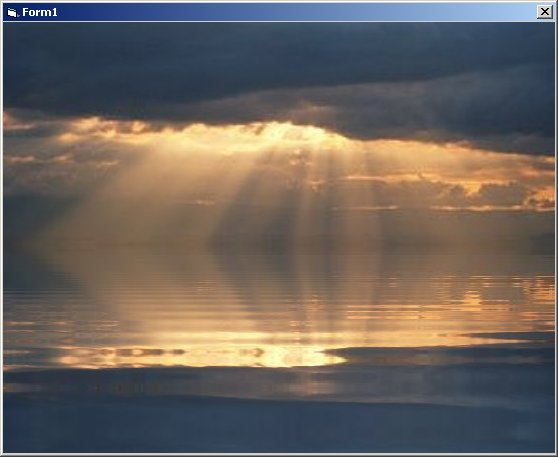



## Shimering Lake Effect

### Description

This program creates a shimmering lake effect by using the DorianGray Java class in a web browser control. Requires only 1 line of code. I did not create the lake effect class, this is just an application of it
 
### More Info
 

             |
---                |---
**Submitted On**   |2004-02-02 15:21:40
**By**             |[Happy Lobster](https://github.com/Planet-Source-Code/PSCIndex/blob/master/ByAuthor/happy-lobster.md)
**Level**          |Beginner
**User Rating**    |3.0 (18 globes from 6 users)
**Compatibility**  |VB 4\.0 \(32\-bit\), VB 5\.0, VB 6\.0
**Category**       |[Graphics](https://github.com/Planet-Source-Code/PSCIndex/blob/master/ByCategory/graphics__1-46.md)
**World**          |[Visual Basic](https://github.com/Planet-Source-Code/PSCIndex/blob/master/ByWorld/visual-basic.md)
**Archive File**   |[Shimering\_170615292004\.zip](https://github.com/Planet-Source-Code/happy-lobster-shimering-lake-effect__1-51613/archive/master.zip)

